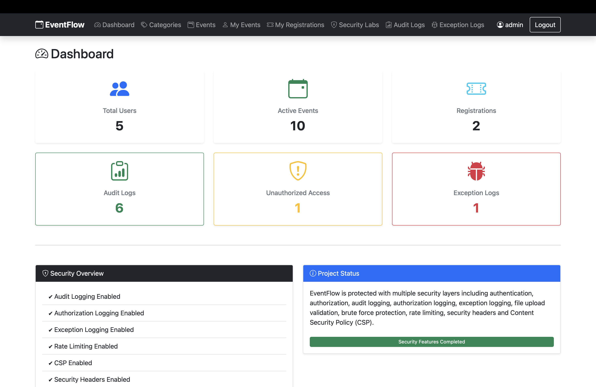
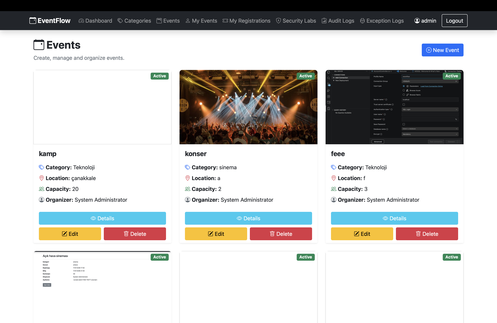
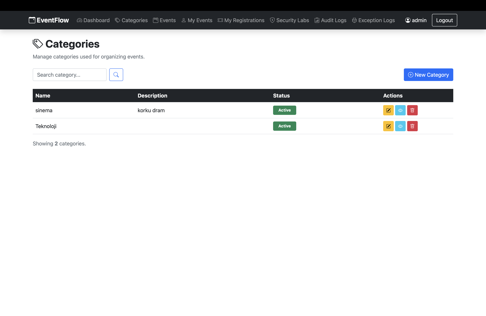
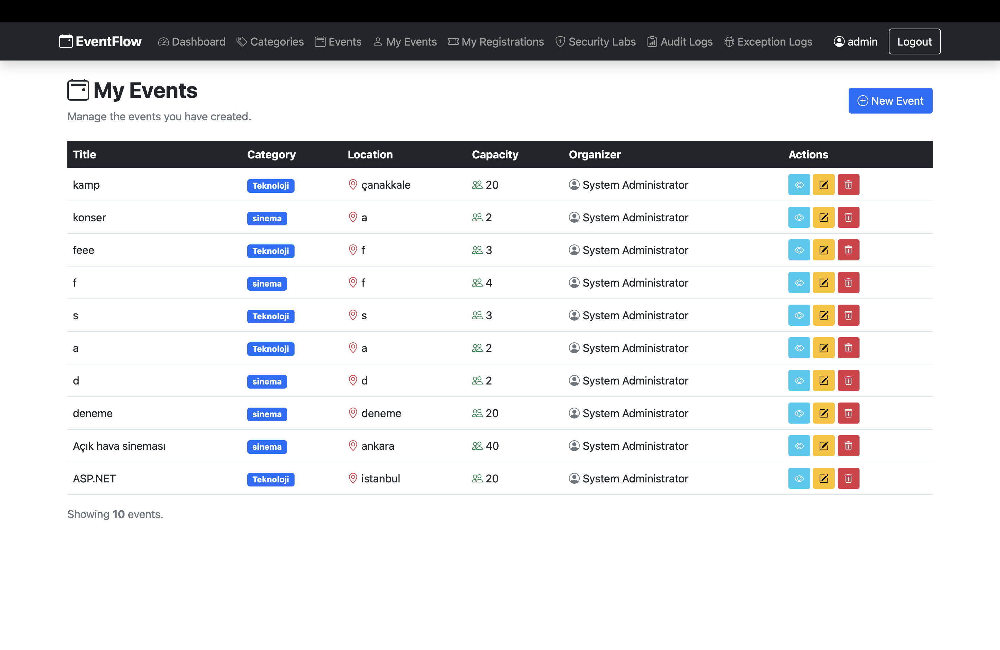
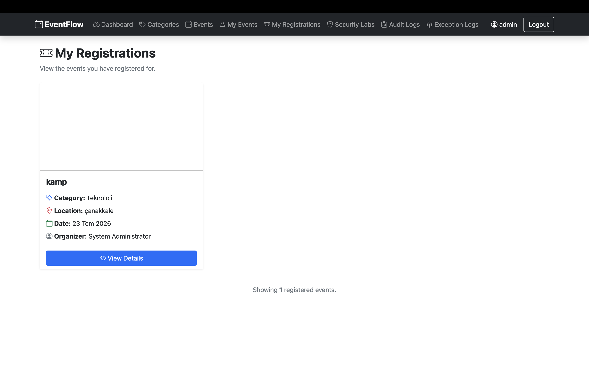
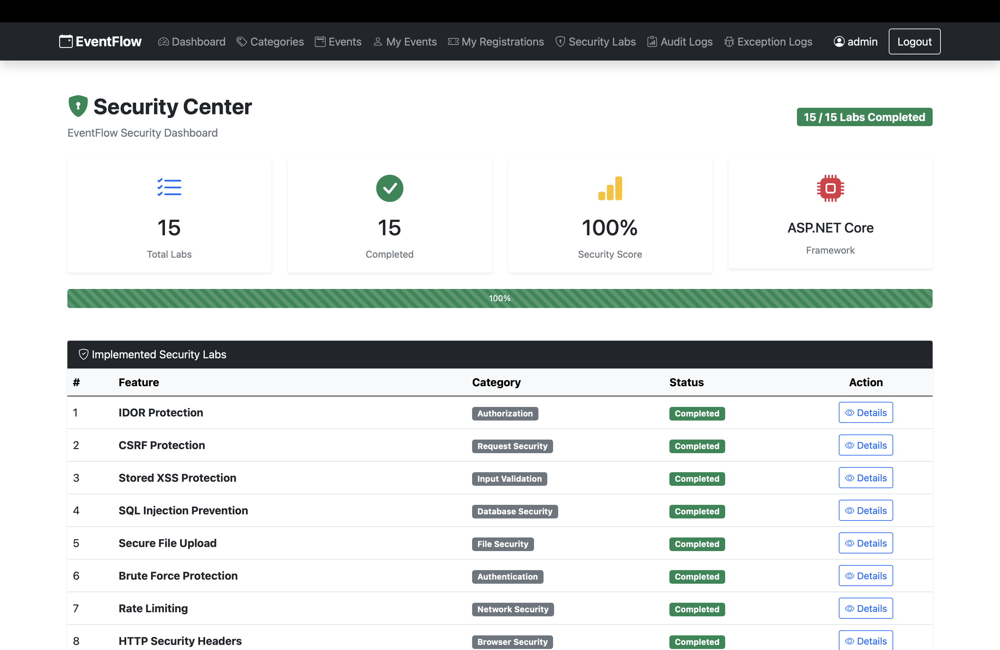
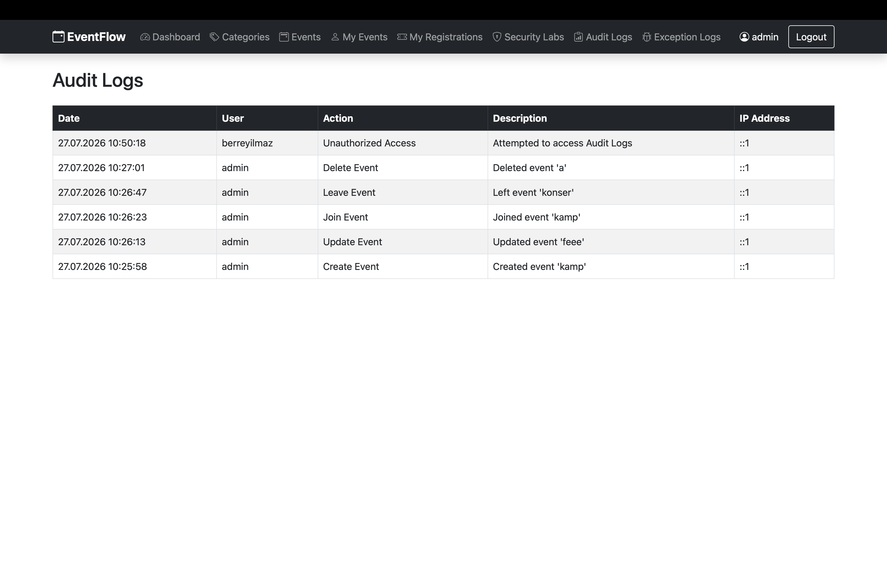
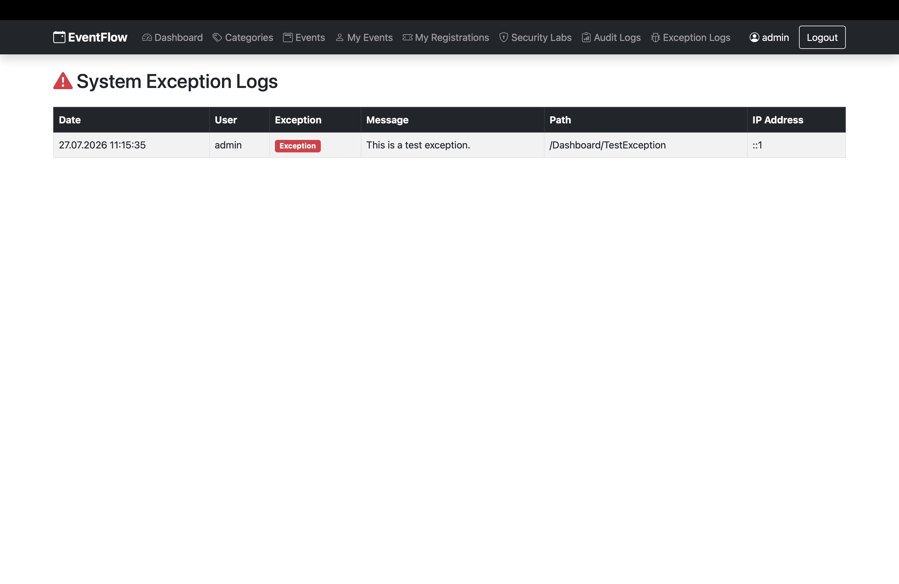

# 🚀 EventFlow

EventFlow is a secure event management system developed with **ASP.NET Core MVC**, **Entity Framework Core**, and **ASP.NET Core Identity**. It provides event creation, registration, participant management, role-based authorization, and multiple security implementations based on OWASP best practices.

---

## ✨ Features

### 👤 Authentication & Authorization

- User Registration & Login
- ASP.NET Core Identity
- Role-Based Access Control (Admin / User)
- Secure Authentication Cookies
- Strong Password Policy
- Account Lockout (Brute Force Protection)

### 📅 Event Management

- Create, Edit, Delete Events
- Category Management
- Event Details
- Event Registration
- Cancel Registration
- My Events
- My Registrations
- Capacity Management
- Participant List

### 📊 Dashboard

- Total Users
- Total Events
- Total Registrations
- Total Audit Logs
- Unauthorized Access Attempts
- Exception Logs

---

# 🔒 Security Implementations

The project includes security practices inspired by the **OWASP Top 10**.

| Security Feature | Status |
|------------------|--------|
| SQL Injection Prevention | ✅ |
| Stored XSS Prevention | ✅ |
| CSRF Protection | ✅ |
| IDOR Protection | ✅ |
| Secure File Upload | ✅ |
| Brute Force Protection | ✅ |
| Rate Limiting | ✅ |
| HTTP Security Headers | ✅ |
| Content Security Policy (CSP) | ✅ |
| Audit Logging | ✅ |
| Authorization Logging | ✅ |
| Global Exception Logging | ✅ |
| Secure Authentication Cookies | ✅ |
| Strong Password Policy | ✅ |
| Data Protection API | ✅ |

---

# 🛠 Technologies

### Backend

- ASP.NET Core MVC
- Entity Framework Core
- ASP.NET Core Identity
- SQL Server

### Frontend

- Razor Views
- Bootstrap 5
- Bootstrap Icons

### Security

- Identity Authentication
- Cookie Authentication
- Anti-Forgery Tokens
- Content Security Policy
- Data Protection API
- Rate Limiting Middleware
- Custom Exception Middleware
- Audit Logging

---

# 📁 Project Structure

```
EventFlow
│
├── Controllers
├── Data
├── Middleware
├── Models
├── Services
├── ViewModels
├── Views
├── wwwroot
├── docs
│   └── Security
└── Program.cs
```

---

# 📷 Screenshots

## Dashboard

> Add screenshot here

## Event Management

> Add screenshot here

## Security Labs

> Add screenshot here

## Audit Logs

> Add screenshot here

---

# 🚀 Installation

Clone the repository

```bash
git clone https://github.com/USERNAME/EventFlow.git
```

Navigate to the project

```bash
cd EventFlow
```

Restore packages

```bash
dotnet restore
```

Update the database

```bash
dotnet ef database update
```

Run the project

```bash
dotnet run --launch-profile https
```

---

## Running the Project

Restore dependencies:

```bash
dotnet restore
```

Run the application using the HTTPS launch profile:

```bash
dotnet run --launch-profile https
```

> **Important**
>
> This project must be run using the **HTTPS** launch profile. Running the application over HTTP may prevent ASP.NET Core Identity authentication and authorization from working correctly because secure authentication cookies require HTTPS.

---

# 📚 Security Documentation

Detailed documentation is available in:

```
docs/Security
```

Each security implementation contains:

- Overview
- Vulnerability
- Implementation
- Testing

---

# 🎯 Learning Objectives

This project was developed to improve knowledge of:

- ASP.NET Core MVC
- Entity Framework Core
- ASP.NET Core Identity
- Secure Coding Practices
- Authentication & Authorization
- OWASP Top 10
- Logging & Monitoring
- Defensive Programming

---

# 📄 License

This project is intended for educational and portfolio purposes.

---

# Screenshots

## Dashboard



---

## Events



---

## Categories



---

## Event Details


---

## My Events



---

## My Registrations



---

## Security Labs



---

## Audit Logs



---

## System Exception Logs

